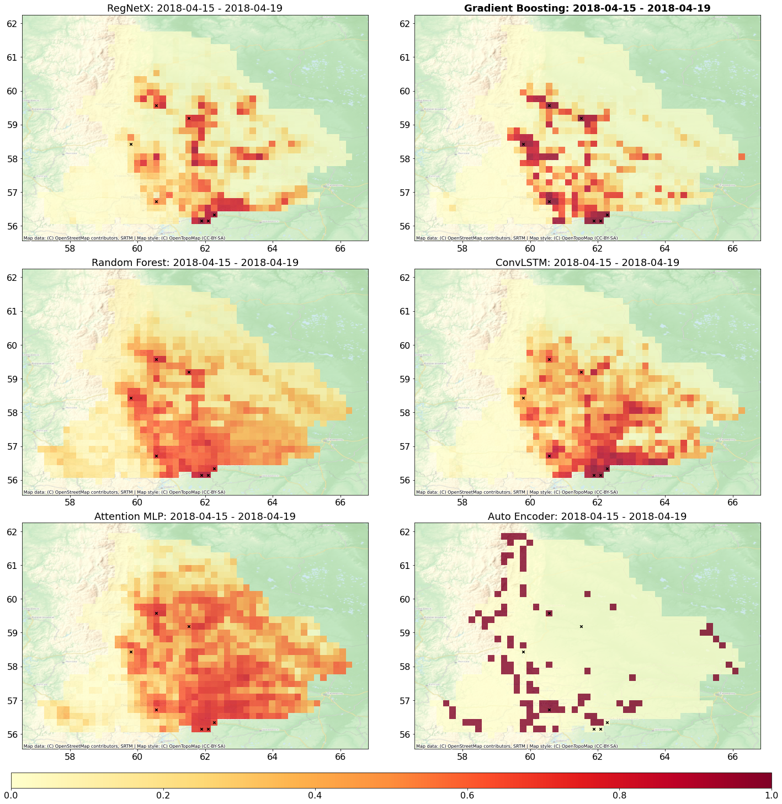

# Wildfire-Forecasting

This repository contains code, weights, and data for reproducing the results from the paper "[Exploration of geo-spatial data and machine learning algorithms for robust wildfire occurrence prediction](https://www.nature.com/articles/s41598-025-94002-4#citeas)". It provides a baseline model and associated scripts for wildfire occurrence prediction in the Sverdlovsk region, based on the methodology described in the paper.

## Repository Structure

```bash
Wildfire-Forecasting/
├── README.md # This file
├── requirements.txt # List of Python dependencies
├── imgs/ # Contains .png with examples of predictions
└── Sverdlovsk_example.ipynb # Jupyter Notebook with example of model inference and visualization

├── models/ # Contains model definitions
│ └── baselines.py # PyTorch implementation of the baseline model

├── predictions/ # Contains model definitions
│ └── sverdlovsk_gradient_boosting.geojson # Model predictions saved in geojson format

├── scripts/ # Contains scripts for data loading, training, and inference
│ ├── ClassNPYdatasetGEN2.py # PyTorch Dataset class for loading the data
│ ├── ClassRunner.py # Class for running inference with the model
│ ├── metrics.py # Defines various evaluation metrics
│ └── utils.py # Utility functions

└── weights/ # Contains pre-trained model weights
│ ├── GradientBoosting_sverdlovsk.pth # Model weights for the Sverdlovsk region
│ └── sverdlovsk.json # config for loading model weights

```

## Dependencies

To run the code in this repository, you will need to install the following Python packages. It is recommended to use a virtual environment to manage dependencies.

```bash
pip install -r requirements.txt
```

## Model

The `models/baselines.py` file contains the definition of a `BaseForestModel`. This model serves as a baseline and uses a pre-trained tree-based model for prediction. 
The model weights for the Sverdlovsk region are provided in the `weights/GradientBoosting_sverdlovsk.pth` file. File `weights/sverdlovsk.json` contains configuration for loading the model.

## Data
The data used in this notebook is available upon request. Please contact <a href="mailto:illarionovasvetlana@yandex.ru">Illarionova Svetlana</a> to request access.

## Inference and Visualization

The [Sverdlovsk_example.ipynb](Sverdlovsk_example.ipynb) Jupyter Notebook demonstrates how to load the pre-trained model, run inference on a sample dataset, evaluate the results, and visualize the predictions. This notebook provides a complete example of using the code in this repository.

The notebook performs the following steps:

1. Loads a sample table with reference data (`sverdlovsk_y2018_100_160.geojson`).
2. Visualizes fire reference cells on a map.
3. Loads the pre-trained Gradient Boosting model.
4. Runs inference using the `ClassRunner`.
5. Calculates evaluation metrics.
6. Visualizes the predictions on a map for several days, saving the plots to the `imgs/` directory.

**Evaluation:** The `scripts/metrics.py` file defines various metrics for evaluating the model's performance, including F1-score, precision, recall, and specificity.

  | 
|:--:| 
| *Figure 13: Comparison of models in the Sverdlovsk Oblast.* |

Source: Illarionova, S. et al. "[Exploration of geo-spatial data and machine learning algorithms for robust wildfire occurrence prediction](https://www.nature.com/articles/s41598-025-94002-4#citeas)" *Scientific Reports* 15 (2025).


